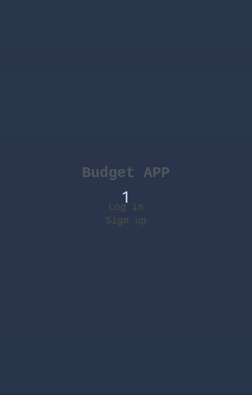

## Description

this is a rails mobile web application where you can manage your budget: you have a list of transactions associated with a category, so that you can see how much money you spent and on what.



## Built With

- Ruby
- Ruby on Rails

## Getting Started

To get the content of this project locally you need to run this command in your terminal:

```bash
git clone your https://github.com/rachidelaid/rails-budget-app.git
cd rails-budget-app
bundle install
rails s
```

## Tests

To run the tests, navigate to the root directory of this app and run

```ruby
rspec
```

## Authors

👤 **Rachid El aid**

- GitHub: [@rachidelaid](https://github.com/rachidelaid)
- Twitter: [@rachidelaid1](https://twitter.com/rachidelaid1)
- LinkedIn: [rachid elaid](https://www.linkedin.com/in/rachidelaid/)

## Show your support

Give a ⭐️ if you like this project!

## 📝 License

This project is [MIT](./LICENSE) licensed.
